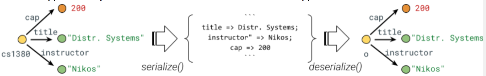

# M1: Serialization / Deserialization


>Collaboration: Individual milestone
>Completion: About 8–10 hours
>Deadline: Monday Feb. 12, 2024 (11:59PM ET)
>Latest handout version: CS1380:2024:M1
>GitHub repo: https://github.com/brown-cs1380/m1


## Table of Contents

- [Introduction](#introduction)
- [Background & Context](#background-and-context)
- [The Core Utility Library](#the-core-utility-library)
- [Base Structures](#base-structures)
- [More Complex Structures](#more-complex-structures)
- [Cycles](#cycles)
- [Reflections](#reflections)
- [Tips & Submission](#tips-and-submission)
- [FAQ](#faq)
- [Feedback](#feedback)


## Introduction


To implement any form of distributed computation, two or more nodes need to communicate — and to do that, they first need to be able to exchange messages. The goal of this milestone is to build the necessary infrastructure for exchanging complex messages between nodes — including converting any value from an in-memory structure to an on-wire message and correctly back to an in-memory structure. Some support for serialization and deserialization often comes built into the programming language or runtime system used — but here you will be implementing the core serialization and deserialization functionality yourself to learn how things work under the hood.


## Background and Context

Typically, there are a few different types of serialization-deserialization support. Some programming languages—especially ones targeting distributed systems e.g., Erlang or Go—offer built-in support for serialization: under their remote-code execution interfaces, they serialize and deserialize values. In other environments, serialization is supported via auxiliary libraries. And then language-agnostic libraries such as Protocol Buffers (Protobuf) allow interoperability across languages (i.e., serializing from a program in one language but deserializing from a program written in a different language.)

In the context of a dynamic environment, the system does not have ahead-of-time knowledge of the structure — thus at runtime it will need to (1) traverse these values and convert them to a string representation (serialization), and (2) parse these strings to convert them into in-memory values (deserialization). The base encoding underpinning your serial structures will be JSON: a JavaScript-native object notation that is human-readable (not binary), interoperable (not JavaScript-specific), and significantly constrained (cannot represent complex structures without additional information). You will be using this base encoding for more complex structures.

Supporting any value from the most recent version of the JavaScript language is beyond the scope of this class; instead we will be working with a small—but non-trivial!—language subset capturing most of EcmaScript 5 (ES5), including the following ES5 types: object, function, error, date, undefined, null, string, array — and several native constructs.

The following online resources might be useful for this milestone:


* JavaScript support for [runtime metaprogramming](https://developer.mozilla.org/en-US/docs/Web/JavaScript/Guide/Meta_programming) and [Reflect](https://developer.mozilla.org/en-US/docs/Web/JavaScript/Reference/Global_Objects/Reflect#examples)
* A [gentle introduction](https://lia.disi.unibo.it/materiale/JS/developer.mozilla.org/en-US/docs/Web/JavaScript/A_re-introduction_to_JavaScript.html) to ES5 types (from an older version of MDN)


## The Core Utility Library

This milestone is the first to introduce the `distribution` library. When loaded, `distribution` introduces functionality supporting the distributed execution of programs. The component responsible for serialization and deserialization is a small part of this library, under its `util` object. Here's its expected use:


```js
let util = require("distribution").util;
let cs1380 = {title: "Distr. Systems", instructor: "Nikos", cap: 200}; 
let s = util.serialize(cs1380); 
let o = util.deserialize(s);
```


Methods `serialize` and `deserialize` are inverse of each other — a deep structural equality check between the two objects should return true. (Variables `cs1380` and `o` do _not_ point to the same object — these objects are simply copies of each other.) The goal of this milestone is to implement these methods to traverse a value at runtime to construct its string representation and, conversely, to parse a string representation into its in-memory object.

The appropriate traversal depends on the exact (type of) value of that object (and its children). For example, arrays require going through all of their elements and serializing them appropriately. Using the built-in JavaScript functions `typeof` and `instanceof` is necessary to distinguish between different types of objects at runtime. Remember that these types can mix!


In the object graphs above, objects are displayed using yellow, numbers are displayed using orange, and strings are displayed using green; the text in the middle is a visual representation of the serialized character stream.


## Base Structures

The simplest possible structures are the base JavaScript types `Number`, `String`, `Boolean`, `null`, and `undefined`. These can be straightforwardly serialized to a string by using their `toString()` method. After attaching some additional metadata, these strings can be sent over the wire — for example:


```js
console.log(util.serialize(3));
{ 
  type: "Number",
  value: "3" 
}
```


As expected, calling `util.deserialize()` on the serialized object should return the value `3`.


## More Complex Structures

There are several structures that are significantly more complex than these base structures — for example, Objects are significantly more complex for a few different reasons. First, they might have a recursive structure and can even mix with one another. A case in which an array of objects contains arrays with numbers and strings is perfectly valid — for example:


```js
var o = [{tr1: [1, "one"], tr2: [2, "two"], tr3: [3, "three"]}]
```


Second, these objects support a form of subtyping and complex construction, which complicates things significantly. For example, `Date` is a subtype of `Object` — with its own methods:


```js
Date().toLowerCase()
```


Therefore serializing `Object`, `Function`, `Array`, and `Date` structures—to name a few—requires additional infrastructure. For many of these, the serialization and deserialization logic has to be custom: for example, functions feature a body and thus require additional deserialization infrastructure for loading and interpreting that part.[^1] Other structures—be it built-in such as `Error` or developer-provided such as `User`—follow a serialization that is mostly similar to one of these objects.

Note, however, that not all functions are serializable — some might depend on some global state. For example, the function `incr` below cannot be properly serialized without additional support, even if the body is indeed serializable and transferable to a remote node:


```js
let sum = 0;
let incr = (n) => {
  sum += n;
  return sum;
}
```


We will return to this challenge later in the next Milestone.


## Cycles

Objects may even feature an additional complexity: cycles. Cyclic structures are ones that contain a value with (or that points to) precisely the same structure. An example is the following simple structure:


```js
let user = { first: "Josiah", last: "Carberry" };
user["self"] = user; // user.self points to user
```


Serializing cyclic structures requires solving a few challenges. One is the ability to detect cycles; solving this requires maintaining and updating an auxiliary map of references that have been seen before — and thus every step involves an equality check to see if an element has been seen before. Another challenge is encoding these cycles; this requires storing and serializing additional information about each element — such as a unique element ID that can be used to create an explicit reference to that element in the serialized version (using some form of special encoding).


## Native Functionality

At times, the user of the serialization library will attempt to serialize native functionality — that is, functionality that is natively provided by the runtime environment and does not have a representation in the source language. One example is `console.log` — you did not write this function nor is it part of a JavaScript module; it is implemented natively by the runtime environment which invokes a corresponding system call provided by the operating system.


```js
> console.log.toString()
'function () { 
  [native code] 
}'
```


But since this is native functionality, it should by definition be built into the runtime environment of other (remote) nodes too (assuming of course identical versions etc.). Thus serializing and shipping such a function to a remote node is a matter of solving two challenges: (1) detecting that the object about to be serialized is indeed native and (2) encoding it appropriately.

One way of solving the former challenge is to create a map of all native functionality. This requires an ahead-of-time pass — using metaprogramming to traverse all possible native objects from a set of pre-defined root objects and create a map of pointers to these objects. By root objects, we mean objects accessible natively from a set of Node [globals](https://nodejs.org/api/globals.html) (e.g., [console](https://nodejs.org/dist/latest-v20.x/docs/api/console.html)) or [built-in libraries](https://nodejs.org/dist/latest-v20.x/docs/api/). These root objects will likely need to be hardcoded. After this structure is complete, the serialization library consults this structure on every object to check whether the element about to be serialized is a native object.

Solving the latter challenge is only a matter of using a unique identifier. Assuming that the serialization library on every node has access to such a reverse map, it can deserialize strings into the appropriate native objects.  


## Reflections

As part of your submission add a small `README.md` markdown file with the following structure, along with answers to the following prompts:


```
# M1: Serialization / Deserialization
> Full name: `<first last>`
> Email:  `<email@brown.edu>`
> Username:  `cslogin`

## Summary
> Summarize your implementation, including key challenges you encountered

My implementation comprises `<number>` software components, totaling `<number>` lines of code. Key challenges included `<1, 2, 3 + how you solved them>`.

## Correctness & Performance Characterization
> Describe how you characterized the correctness and performance of your implementation

*Correctness*: I wrote `<number>` tests; these tests take `<time>` to execute. This includes objects with `<certain kinds of features>`.

*Performance*: Evaluating serialization and deserialization on objects of varying sizes using [high-resolution timers](https://nodejs.org/api/perf_hooks.html) results in the following table:

|               | Serialization | Deserialization |
| ------------- | ------------- | --------------- |
| 100 elems     | `<time>`      | `<time>`        |
| 1000 elems    | `<time>`      | `<time>`        |
| 10000 elems   | `<time>`      | `<time>`        |
| 100 funcs     | `<time>`      | `<time>`        |
| 1000 funcs    | `<time>`      | `<time>`        |
| 10000 funcs   | `<time>`      | `<time>`        |
| 1000 cyles    | `<time>`      | `<time>`        |
| native objects| `<time>`      | `<time>`        |
| ...           | `<time>`      | `<time>`        |

## Time to Complete
> Roughly, how many hours did this milestone take you to complete?

Hours: `<time>`

## Wild Guess
> This assignment made a few simplifying assumptions — for example, it does not attempt to support the entire language. How many lines of code do you think it would take to support other features? (If at all possible, try to justify your answer — even a rough justification about the order of magnitude and its correlation to missing features is enough.)

FLoC: `<guess a number>`
```


## Tips & Submission

Here are some guidelines that might be helpful:


* Make sure you study the provided test cases — their inputs and outputs usually offer significant insights into the expected implementation structure. 
* Write additional tests to confirm that your implementation works as expected; try to test the limits of your implementation in your test.
* Read the documentation of packages — standard and third-party ones. (N.b. the only third-party packages allowed are the ones already provided with the implementation.)
* Execute `eslint` frequently, and use the `--fix` flag to correct some of the style errors automatically.

To create a submission, run `s/submit.sh` from the root folder of M1. This will create a `submission.zip` file which you will then upload to [Gradescope](https://www.gradescope.com/) (select "managed submission" and then upload your zip manually). The zip archive will contain a `javascript/src/main` folder inside which all the files tracked by git and found to be modified. Make sure to `git commit` any new files you have created before running the submit script; the `s/submit.sh `script will not include any untracked files in the submission.

You are allowed to submit as many times as you want up until the deadline; so _submit early and often_. For full grade, before submitting the final version of your code make sure that (1) all linters run without any errors, (2) the provided tests run without any errors, and (3) you have provided an additional five or more tests with your implementation.


## FAQ


Are we allowed to use `JSON.stringify()`
- It's allowed to use and it's encouraged. However, It won't turn the whole assignment to two lines of code. 

Where to find set of Node globals (e.g., `console`) or built-in libraries
- You need to traverse all possible native objects and modules from the `globalThis` object. 

What is the serialize and deserialize built-in constructors doing?
- the test is serializing the constructor functions (e.g. `String`).
- Remember, both objects and functions can have properties/methods, which is not obvious, and you need to explicitly identify both native objects and functions and encode them separately. 
- Use `Object.getOwnPropertyDescriptor` to skip properties that cannot be accessed
## Feedback 

Please let us know if you find any mistakes, inconsistencies, or confusing language in this or any other CS1380 document by (1) emailing [cs1380headtas@lists.brown.edu](mailto:cs1380headtas@lists.brown.edu), or (2)  filling out the [M1 anonymous feedback form](https://forms.gle/B1bHazXnLPTX26XQ8). In both cases, concrete ideas on how to improve things would be appreciated.

<!-- Footnotes themselves at the bottom. -->
## Notes

[1]:
     Support for shipping functions across nodes in our distributed system is crucial; this is how we'll extend the functionality offered by the nodes of our distributed system.
